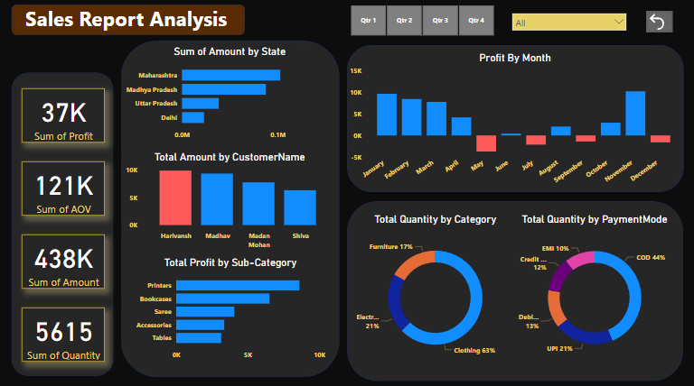

# Sales Analysis Report using Power BI

This Sales Analysis Report is created using a combination of tools and platforms including Power BI, Power Query Editor, Microsoft PowerPoint, Adobe Color, and Kaggle. It provides a comprehensive analysis of sales data extracted from two CSV files: `details.csv` and `order.csv`. The report aims to offer insights into sales performance, trends, and patterns to facilitate informed decision-making for business stakeholders.

## Data Sources

- **details.csv**: Contains information about product details such as product ID, name, category, and price.
- **order.csv**: Includes transactional data such as order ID, customer ID, product ID, quantity, and date.

## Key Insights

- **Sales Overview**: Provides an overview of total sales, revenue, and profit over time.
- **Product Analysis**: Analyzes sales performance by product category, quantity sold, revenue generated, and profit margins.
- **Customer Insights**: Offers insights into customer behavior, such as top customers by sales volume and revenue.
- **Time-Based Analysis**: Tracks sales trends over time, including monthly and yearly performance comparisons.

## Tools Used

- **Power BI**: Used for data visualization and creating interactive dashboards.
- **Power Query Editor**: Employed for data cleaning, transformation, and integration.
- **Microsoft PowerPoint**: Utilized for creating presentations to summarize key findings and insights.
- **Adobe Color**: Used for color scheme selection to ensure visually appealing and cohesive visualizations.
- **Kaggle**: Possibly utilized for accessing additional datasets or for research purposes.

## Visualizations

The Sales Analysis Report utilizes various visualizations including bar charts, line charts, donut charts, cards, and slicers to present data insights effectively.

## Installation and Usage

To access and utilize this Sales Analysis Report:

1. **Power BI**: Install Power BI Desktop if not already installed and open the provided .pbix file.
2. **Data Import**: Import the `details.csv` and `order.csv` files into Power BI Desktop.
3. **Visualization**: Explore different pages of the report to view various analyses and insights.
4. **Interact with Visualizations**: Filter data, drill down, or hover over data points for more details using interactive features.
5. **Export**: Export visuals or entire report pages for presentations or further analysis.

## Feedback and Contributions

Feedback and contributions are welcome! If you have any suggestions for improvement or would like to contribute additional features, please feel free to provide feedback or contribute to the project.

